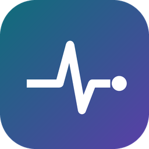
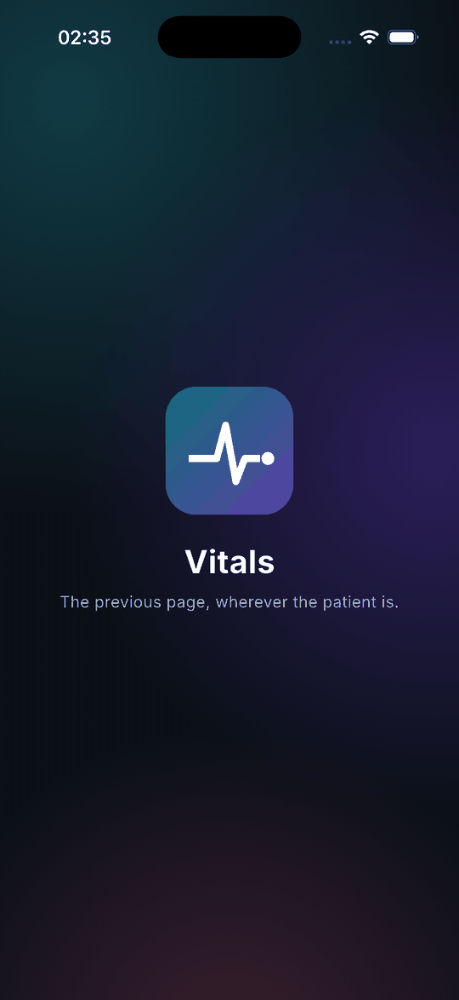
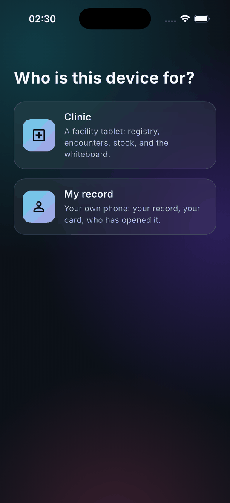
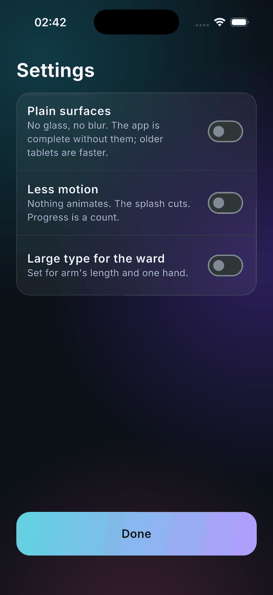
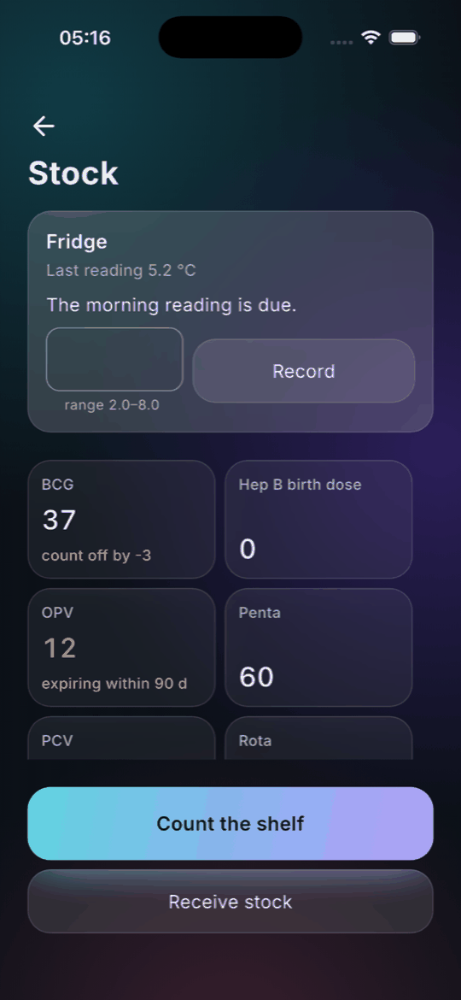
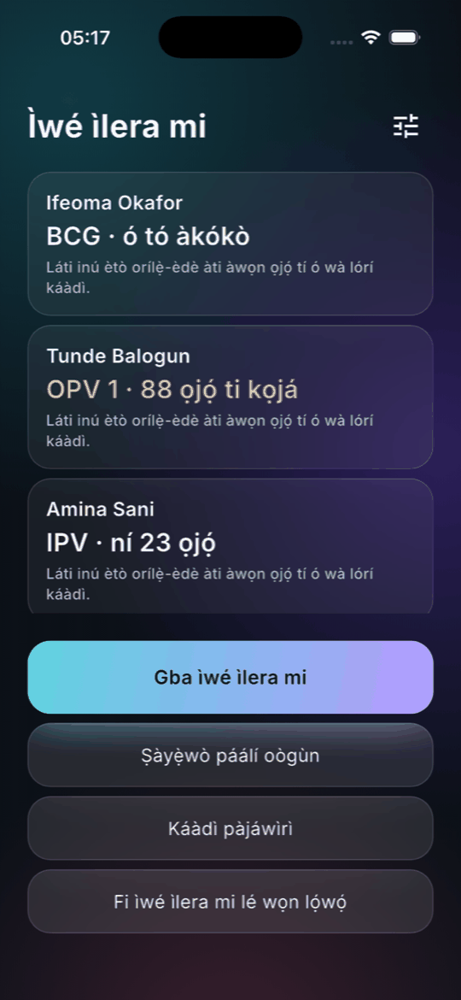
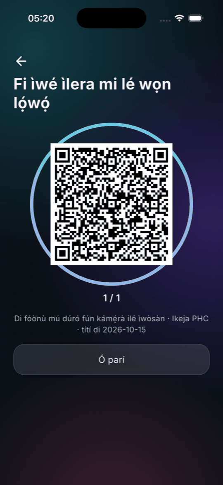

# Vitals

**Portable primary health records and drug authenticity verification for Nigeria.**

Two failures, both fatal, both caused by missing information at the point of care.

Nigerian primary healthcare runs on paper, so there is no continuity: a pregnant woman attends
antenatal care at one clinic, travels to deliver, and arrives somewhere that knows nothing about
her rising blood pressure — pre-eclampsia is detectable from a trend and invisible from a single
reading. Separately, falsified and substandard medicines circulate at a rate that makes them a
genuine cause of death, concentrated in exactly the categories where failure kills fastest.

Vitals is one clinical record with two faces: a **clinic tablet app** that works offline
indefinitely, and a **patient phone app** holding a portable copy they carry between facilities.

See [`docs/00-PRODUCT-STATEMENT.md`](docs/00-PRODUCT-STATEMENT.md) for the full analysis.

---

## Status

**Phase 3 of 8 — immunisation, the wedge; Phases 0 to 2 cleared the same day, short of the tablet.** The plan was
written first: the roadmap in eight phases with an exit gate each, eight ADRs — the
one codebase with two faces, the domain that imports nothing, facts that merge by
union, a .NET backend with no authority, glass over a gradient with a solid floor, an encrypted append-only store —
and thirty more things each checked against the rules, with three refused for
crossing into clinical judgement.

Then the core, twice. A pure Dart domain — a hybrid logical clock, immutable facts,
a record that is a set, union as the whole merge, supersession as correction, one
byte encoding — with five invariants property-tested over three hundred generated
worlds of three devices recording, correcting and exchanging in generated orders,
and a harness test that runs a last-writer-wins merge through the same worlds and
must see loss. Then the same engine in C#, held to the Dart by a checked-in fixture
of two hundred worlds merged forward, reversed, shuffled and halved, to the byte —
and the .NET replica that stores and relays those bytes and computes nothing
clinical.

And the design as code: the gradient mesh, glass in three depths with a solid twin
for each, four motion tokens with a zero for each, the mark drawn by a script at
every size, the splash with its one sweep, the two faces, the lock behind glass, the
attribution and sync-honesty chips — with a contrast test that composites every text
colour on every glass fill over every wash, light and dark.

Seven build gates in the Makefile, each broken on purpose and watched to fire. Six gates, in [`docs/RELEASE-GATES.md`](docs/RELEASE-GATES.md), block v1.0: two tablets in a clinic,
a nurse against a paper baseline, two handsets of each platform, the reference tablet, a
clinician's hour, and a programme partner.

## The design, on a screen

  
  
  

Glass over a gradient mesh, in three depths that each mean one thing; one gradient-filled
control per screen; and under all of it a solid floor — `Plain surfaces` and `Less
motion` in Settings, read at act time, and the same app either way.

  
  
  

  

The demo clinic in the screenshots is synthetic — invented names, invented dates —
seeded behind `--dart-define=VITALS_DEMO=true` into an empty store, and never a
record.

## The numbers

| | |
|---|---|
| Domain tests | 51 in Dart, over 300 generated worlds; 4 in C# over the 200-world parity fixture |
| App tests | 58 — flow, contrast on every wash, lock, one primary action, 200% text, the encrypted log, the records, backup and restore, the mirror, registration, the duplicate assistant, search across 50,000, the card, a scanned vial, an expired vial refused, catch-up, the whiteboard, the printed card, the reminders, vitals with a draft that survives a kill, the danger-sign checklist, stock counted by tapping, the fridge, the patient face in five languages, the share grant enforced in the bytes, the animated QR, the access log, a pack checked with three outcomes, the emergency card on the lock face, the referral letter, the audit export signed and verified under Python |
| Server tests | 4 — push, pull, the replica's bytes, a refused bundle |
| Blocking gates | 7 in `make gates`, each proved to fire |
| Release gates | 6 |
| ADRs | 8 |

## The insight

**The hard problem is not the record. It is merging two records that were both edited while
neither could see the other.**

Two nurses on two tablets in one clinic, offline for a week, both updating the same patient. Or a
patient's phone meeting a facility's tablet after both changed. A conventional last-writer-wins
system silently destroys clinical data in this situation — and here, silent data loss is not a
bug, it is a patient harm.

Vitals treats clinical observations as **immutable facts that merge by union, never by
overwrite**. A blood pressure taken on Tuesday and one taken on Wednesday are both true. They do
not conflict. They both survive.

That single modelling decision is what makes a genuinely offline clinical record safe, and it is
the technical core of the product.

## Does it need a backend?

**Yes, but later and thinner than you would expect.** A single-facility deployment runs
**entirely serverless** — every clinical workflow is on-device, and records move between devices
peer-to-peer over BLE or a QR handshake with no network and no server at all.

A backend arrives for multi-facility continuity and supervisor oversight. Even then it is a
replica with **no special authority**: it runs the same merge semantics as the client, and it
performs no server-side validation that could reject a record a tablet accepted.

The design rule is absolute: **if a nurse needs it to see a patient, it runs on the tablet.** A
rural clinic may be offline for three weeks. A system that degrades when offline is a system that
does not work.

## What it will not do

Vitals presents records, trends and protocol checklists. It **does not** compute a diagnosis, a
risk score, a triage category, or a treatment recommendation. Crossing that line turns the
product into a regulated medical device — and the clinician's judgement is the point.

## Platforms

Android 8+ and iOS 14+, phone and tablet, from one codebase. The genuinely hard cross-platform
problem is **device-to-device transfer between mixed Android↔iOS pairs**, where BLE is the
guaranteed path and chunked animated QR is the floor that works between any two devices with a
screen and a camera.
