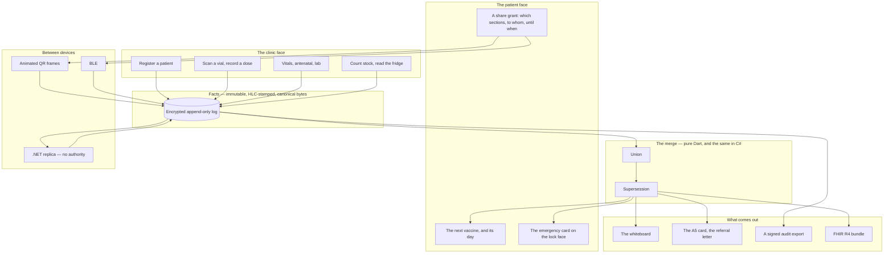
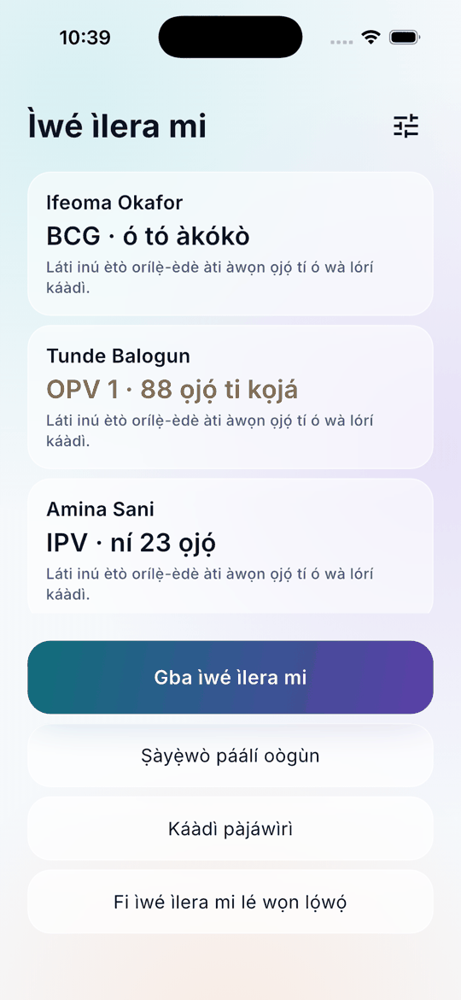

# Vitals

Portable primary health records for Nigeria.

Vitals is one clinical record with two faces: a clinic tablet that works
offline indefinitely, and a patient phone that carries a portable copy between
facilities. Records are facts that merge by union, never by overwrite, so two
devices that were both edited while neither could see the other lose nothing
when they meet. Nothing clinical is computed.

<p align="center">
  
  
  
</p>

---

## 1. The problem

A Nigerian primary health record is a paper card, and the card stays where it
was written. A child immunised in one clinic and seen in another starts again.
A pregnant woman attends antenatal care at one clinic, travels to deliver, and
arrives somewhere that knows nothing about her rising blood pressure —
pre-eclampsia is detectable from a trend and invisible from a single reading.
Every digital attempt so far has assumed a network that a rural clinic does not
have for three weeks at a time.

The hard problem is not the record. It is this:

> **Two records, both edited while neither could see the other, have to become
> one record with nothing lost.**

Two nurses on two tablets in one clinic, offline for a week, both updating the
same child. A patient's phone meeting a facility's tablet after both changed. A
conventional last-writer-wins system silently destroys clinical data in that
situation, and here silent data loss is not a bug — it is a patient harm. That
one modelling decision is the technical core of the product, and it was built
first, twice, before a single screen.

### What it is not

**Vitals computes nothing clinical.** It presents records, trends and protocol
checklists. A pulse is printed beside the published range and marked *outside
range* by a comparison, never named *high*. The antenatal danger signs are ten
questions a nurse answers, each one, and nothing sums them. A pack is *on the
list*, *not on the list*, or *the list cannot say*, and no language it speaks
has a fourth word. Crossing that line turns the product into a regulated
medical device, and the clinician's judgement is the point. A copy gate fails
the build on the words that would cross it, and a test greps the domain's own
source for *score*, *risk*, *triage* and *severity* so that a future feature
fails before it is a device.

**The server has no authority.** If a nurse needs it to see a patient, it runs
on the tablet. A single facility runs with no server at all; records move
between devices over BLE or an animated QR. The .NET replica, when there is
one, merges what it is handed with the same engine and hands back what a
tablet lacks. It decides nothing and it can reject nothing a tablet accepted.

**Honest about what is known.** *Last met another device: three days ago*,
never *synced*. Every language but English says *a draft, not yet read by a
speaker* where it is chosen. A trend is drawn; it is never interpreted.

---

## 2. How it works



### Facts, and the set they make

A **fact** is one observation: a registration, a dose with its vial's batch
and expiry, a blood pressure, a stock count, a fridge reading, a share grant,
an access. Every fact carries a hybrid logical clock stamp, an author and a
device, and encodes to one canonical byte string that every device and the
server compute identically. A record is a set of facts. There is no update
path and no delete path anywhere — a correction is a new fact that supersedes
an old one, and the old one survives, hidden.

**The merge is set union.** Two devices meet, each takes the other's facts,
and the record is the union. A blood pressure taken on Tuesday and one taken
on Wednesday are both true; they do not conflict and both survive. Five
invariants — nothing is lost, order does not matter, merging twice is merging
once, a correction hides its target everywhere, two corrections made apart are
both kept — are property-tested across three hundred generated worlds of
three devices recording, correcting and exchanging in generated orders. A
harness test runs a last-writer-wins merge through the same worlds and must
see loss, so the suite is proved to be able to fail.

**Which of two corrections is right is not the merge's question.** When two
devices correct the same fact while apart, union keeps both; the original is
hidden; and the record shows both corrections and neither as lost. Who was
right is the nurse's call.

### The same engine, twice

The .NET replica runs the merge in C#, held to the Dart by a checked-in
fixture of two hundred worlds merged forward, reversed, shuffled and halved,
to the byte. The second verifier found the first's blind spot on its first run
— see [§6](#6-correctness-notes) — which is the reason there are two.

### Handing the record over

A **share grant** — which sections, to whom, until when — is a fact on the
patient's record, and it is enforced where the payload is built, not where it
is displayed. The record leaves as frames: `VITALS/1 ` and a base64 hand, one
per QR image, cycled on the screen. A test gathers the frames off the screen
the way a camera would, reads the record back, and finds the note that was
never in the bytes. The same frames travel over BLE, behind a transport façade
with a lossy in-memory pair for the tests. Every open of a record is a fact the
patient sees on their own phone.

### The design

Glass over a gradient mesh, in three depths that each mean one thing: the
page's record, a card of facts, a control that acts. One gradient-filled
control per screen. Under all of it a solid floor — `Plain surfaces` and
`Less motion` in Settings, read at act time, and the same app either way —
because the reference tablet is a three-year-old 10" with 3 GB of RAM under
one window. Light and dark are both authored, and a test composites every
text colour on every glass fill over every wash and asserts the contrast.
[`DESIGN.md`](DESIGN.md) is the system; `palette.dart` is it as code, and a
gate fails if the two disagree or a screen names a colour of its own.

---

## 3. The app

Seventeen screens across two faces, all of them offline, all of them on one
device.

### Which face

<p align="center">
  
  
  
</p>

One codebase, two faces, chosen once on first launch. The clinic face is a
tablet on a desk and speaks English; the patient face is a phone in a pocket
and speaks the patient's language on every screen the patient sees, including
the two the faces share. Both sit behind a lock. Settings holds the floor —
plain surfaces, less motion, large type for the ward — each with its sentence.

### The whiteboard, and the wedge

<p align="center">
  
</p>

The clinic's home is the ward's whiteboard: who is due today, who is behind
and by how many days, furthest-behind first, with a message draft for the
mother. Immunisation is the wedge because it is the one clinical workflow that
is a schedule and a record and nothing else: the national schedule as a
versioned table with catch-up; a dose as a fact with the vial's batch and
expiry read from its GS1 barcode; an expired vial refused before anything is
written; the A5 card as a PDF in the national layout; the reminder on the
mother's phone naming the next vaccine and its day.

The whiteboard once listed a mother as 9,855 days overdue for BCG. That is in
[§6](#6-correctness-notes).

### Vitals, antenatal, stock, the fridge

<p align="center">
  
</p>

Readings are integers in fixed units, with the pulse card on the patient
header, the published range printed beside each number, and the trend drawn
behind it and never interpreted. Forms draft on every keystroke, and a test
throws the tree away and proves the draft comes back. The antenatal visit
cannot be recorded until all ten danger signs are answered, one by one, and
nothing sums them. Stock is counted by tapping tiles; a unit is issued with
every dose in the same write; the fridge is asked twice a day with its range
printed beside the box, and a batch inside ninety days of expiry is marked.

### The patient's phone

<p align="center">
  
  
  
</p>

Five languages — English, Naijá, Yorùbá, Hausa and Igbo — held complete by a
gate, with every language but English admitting it is a draft until a speaker
has read it. The emergency card — blood group, allergies, the person to call —
on the lock face while the patient opts in, and never on a clinic tablet. The
share screen shows the grant in words above the code: which sections, to
which facility, until which day. The QR sits in a rounded frame whose edge
fills in the brand gradient as the frames go by, so a nurse holding a camera
can see how much is left.

### Receiving, verifying, referring

The receive screen is a camera that reads frames in any order and says how
many of how many it has, with a paste box as the floor for a device with no
camera. The verify screen reads a pack's GS1 barcode and answers *on the
list*, *not on the list* or *the list cannot say*, with a facility list from
the phone's position for reporting one. The referral letter is a PDF with the
receiving facility named and the sections the grant allows. Lab results and
events after a dose are facts like every other.

### The supervisor's side

The .NET replica counts facts and distinct patients by facility and month with
no patient on the page, rolls facilities up to a local government area, lists
reported packs, and shows a signal when one facility's month is out of step
with its own history — a count, not a diagnosis. A supervisor with the admin
token can wipe an enrolled device that is lost; the device zero-fills its log
before it deletes it, and asks the replica whether it should on every sync.

---

## 4. What each layer does

### `packages/vitals_domain` — the rules, with nothing under them

A pure Dart package. It imports nothing — not Flutter, not a clock, not
randomness — and `make domain-purity` fails the build if it ever does, in the
plain import form and the `show` form both. Every device and the server must
compute the same bytes from the same facts, and a domain that reads a clock or
a platform cannot promise that.

It holds the hybrid logical clock, the fact, the canonical encoding, the
record, the merge with its five invariants, registration and Nigerian-name
phonetics, the registry's search, the immunisation schedule with catch-up,
observations with their published ranges, antenatal, stock and the cold chain,
lab results, GS1, the share grant and access, verification, the emergency
card, the frames, and the strings the patient face reads. It carries a **95%
line-coverage gate** and nothing else in the repository does. A test greps
its source for the words a judgement would use.

### `app/lib/store` — an encrypted append-only log

Facts are appended as canonical bytes under a key held in the platform
keychain; the log is read into a record at open and never rewritten. Drafts
are written beside a form on every keystroke and renamed into place, chained
per form so two keystrokes cannot race for one temporary file. The audit is a
signed export — the tablet's own Ed25519 key over every access — that a
supervisor verifies with [`scripts/verify-audit.py`](scripts/verify-audit.py)
and nothing but Python; the test runs it on a good file, a flipped byte and
the wrong key. Backup is every fact into one file under a passphrase the app
never keeps, and restoring adds rather than replaces.

### `app/lib/transport` — the link, and what carries it

A `PeerLink` carries frames and knows nothing about what is in them. The QR
path renders frames on a screen and reads them with a camera; the BLE path is
`bluetooth_low_energy` behind the same façade; a `MemoryLink` with a lossy
pair drives the handover in tests, so the retry and the *n of m* are proved
without a radio. Sync with the replica is `HttpTransport` over `dart:io`, and
it asks first whether the device has been wiped.

### `app/lib/report` — paper, and FHIR

The A5 card in the national layout, the referral letter, and a FHIR R4 bundle
with CVX, LOINC and UCUM codes and deliberately no `interpretation` and no
`referenceRange` — the bundle carries the number and never the judgement. The
PDFs print in the light palette's ink; the design gate does not know about
PDFs and did not need to.

### `server` — a replica with no authority

.NET 9. `Vitals.Domain` is the merge in C#, held to the Dart by the parity
fixture. `Vitals.Infrastructure` is a fact store with a `Kind` column and a
Postgres or in-memory backing. `Vitals.Api` pushes and pulls bytes, refuses a
bundle it cannot decode, enrols devices, wipes one on a supervisor's token,
aggregates by facility and month, and serves the dashboard. It computes
nothing clinical, and the same grep runs over its source.

---

## 5. Quick start

### See it work first

A fresh install has one empty record. A synthetic demo clinic — invented
names, invented dates, six patients, two children due, one behind, a fridge
reading and a stock count — is compiled in only under a flag and seeded only
into an empty store:

```bash
cd app
flutter run --dart-define=VITALS_DEMO=true
```

It refuses to run against a store that already holds a patient, so it can
never sit beside a real record, and it writes through the ordinary log —
there is no second write path.

### The tests, without a device

```bash
make test-domain      # the five invariants over generated worlds, in seconds
make test-app         # the widget suite
make test-server      # xunit: parity with the Dart, and the API
make parity           # the Dart and the C# agree on every byte of the fixture
```

### The replica

```bash
make server-run       # 127.0.0.1:5120, in-memory store
```

Point the app at it from Settings → Enrol with a URL and a facility name.
Postgres is a connection string away; the tests run against the in-memory
store and need no database.

### Building properly

```bash
cd app && flutter pub get
export LANG=en_US.UTF-8      # CocoaPods fails with Encoding::CompatibilityError otherwise
flutter build ios --simulator --debug
flutter build apk --debug
```

CI pins Flutter 3.47.1 — the version this machine has — which is the honest
form of "works on my machine": say which machine.

---

## 6. Correctness notes

The parts that were harder than they looked, and the bugs that reached a
green suite.

### An invariant that passed over nothing

The third invariant — a correction hides its target everywhere — was green in
Dart over three hundred worlds. The C# parity test asserted, on its first run,
that the worlds contained corrections at all. They did not: the generator's
`state % 4` never produced a 2, because an LCG's low bits cycle in a handful
of steps, a thing every textbook says and every hand forgets. The Dart test
had been proving an invariant over a set of zero supersessions. The generator
takes its high bits now, the Dart test asserts the count, and the fixture was
regenerated. The second verifier found the first's blind spot the night it was
written.

### A phone found what fifty-eight widget tests had not

Twenty minutes on a simulator with the synthetic clinic: the whiteboard listed
a mother as 9,855 days overdue for BCG, because the schedule had no idea it was
a child's. `Schedule.covers` — under five — is a domain rule now, and the exit
gates that say *on a real device* are there for a reason.

### The twins were one person

The first duplicate rule took *same phone and family name* as a reason, and in
Lagos a household has one phone. Kehinde matched Taiwo. The phone counts only
with the given name now, and the twins test keeps it so. In the same session:
a hyphen is a joiner, not a space — Ade-Ola is one name — and the tokeniser
had been splitting it.

### The copy gate refused "Record a dose"

The word list had *dose* for dosing advice, and a vaccine dose is the record's
own word for a thing given, never advised. The list says *dosage* and any
quantity in mg, ml or mcg now, and was broken on purpose with "Give 5 mg" to
see it still bite. The same guard, one layer down, found the registry's search
`score` — not clinical, renamed anyway, because a guard with an exception list
is a guard with a hole.

### The gates refused paper, and black

`PdfColors.grey700` on the printed card tripped the palette check, and the
check was right: the card is the product's face on paper, and it prints in the
light palette's ink now. The QR's modules were `Colors.black`, a colour outside
the palette; it is in the palette now, as `code`, with the note that a camera
reads it and a person does not. Neither gate learned an exception.

### A widget test's clock does not turn real file IO

Every file touch in a widget test — the store opening, a draft written on a
keystroke, a tap whose side effect writes — has to run inside `runAsync`, or
the write sits in the fake zone and the next thing that waits on it waits
forever. It was learned three times, one layer further in each time, and the
test files say so at the top. The test binding also answers every
`HttpClient` with a 400 until the override is cleared, and it is a setter
only.

### Naijá shares words with English

Fifteen of forty-four keys were identical to the English, some rightly
(*days*, *of*), some lazily (*Done*, *Next*). The test that catches a
translation that is English under another name had to know how many are
allowed: the lazy ones are Naijá now and the threshold is a sixth of the keys.

### A patched line the formatter had reflowed

Twice a replacement found nothing to replace and said nothing, and a test
failed for a reason that made no sense until the file was read. Read the file.

---

## 7. The documentation pipeline

Five documents move as the work moves, and a gate in
[`scripts/doc-check.sh`](scripts/doc-check.sh) runs in `make ci`.

| Document | Answers | Updated |
| --- | --- | --- |
| [`docs/JOURNAL.md`](docs/JOURNAL.md) | What did we do, and what surprised us? | Every session |
| [`CHANGELOG.md`](CHANGELOG.md) | What changed for someone using this? | Every user-visible change |
| [`docs/adr/`](docs/adr/) | Why is it built this way? | Any non-obvious decision — `make adr T="..."` |
| [`docs/ROADMAP.md`](docs/ROADMAP.md) + `PHASE` | Where are we, and what finishes this phase? | When a gate goes green |
| [`docs/RELEASE-GATES.md`](docs/RELEASE-GATES.md) | What blocks v1.0, and what would clear it? | When a gate is added or cleared |

The gate checks that every required document is **tracked by git**, not
merely on disk, and that the screenshots the README embeds are tracked too —
a README that renders broken images on GitHub is worse than one with none.
`make counts-check` derives every figure the README quotes — the gates, the
ADRs, the thirty things — from the documents themselves, because a README that
says *six gates* a month after a seventh was added is worse than one that says
nothing.

---

## 8. Data handling

Everything is on the device, encrypted, and nothing leaves it without a fact
saying so.

| Class | Examples | Rule |
| --- | --- | --- |
| On the device, encrypted | Every fact: registrations, doses, readings, grants, accesses | An append-only log under a keychain key. A wiped device zero-fills before it deletes |
| Leaves only under a grant | The sections a patient chose, to a facility they named, until a day | Enforced where the bytes are built; a fact outside the grant is never in the frames |
| Every open is a fact | Who opened which record, on which device, when | The patient sees it on their own phone; the audit export is signed by the tablet's key |
| Never computed | A diagnosis, a risk, a triage, a dose | Not in the domain, by grep; not in the copy, by gate |
| The replica holds | Canonical bytes, by facility | It merges and relays; it reads nothing clinical and rejects nothing a tablet accepted |
| Never in the repository | A real record | Fixtures are synthetic; the demo clinic is invented names |

---

## 9. Development

```bash
make ci                # everything CI runs: gates, analyze, tests, parity, coverage
make gates             # the blocking checks alone
make brandmark         # draw the mark at every size; brandmark-check fails if it drifted
make parity-fixture    # rewrite docs/parity from the Dart — refuses to overwrite
make adr T="..."       # a new ADR, numbered and templated
make phase             # what phase this is, and its exit gate
```

Seven gates block `make ci`: documents, design, counts, copy, languages,
domain purity and the brand mark, with coverage on the domain. **Every one
was broken on purpose and watched to fire before it was trusted**, and each
found a real defect in the same session — the copy gate found *dose*, the
design gate found paper and black, the purity gate found `show`.

### Before a feature is called done

- The domain change is unit tested; the merge invariants still pass if the
  merge was touched
- The copy gate and the source grep are green: nothing interprets, nothing
  scores
- Light and dark authored; every pair contrast-asserted; glass and solid
- 200% text; every control labelled for a screen reader
- Every string the patient sees goes through the table, in all five languages
- An ADR for any non-obvious decision; `CHANGELOG.md` and the journal updated
- `make ci` green

---

## 10. Layout

```text
packages/vitals_domain/lib/src/   the clock, the fact, the canonical bytes, the merge,
                                  registration, the registry, immunisation, observations,
                                  antenatal, stock, the cold chain, lab, GS1, grants,
                                  access, verification, the emergency card, the frames —
                                  imports nothing; Apache-2.0, separately
packages/vitals_domain/test/      the five invariants over generated worlds; the LWW harness
app/lib/screens/                  the seventeen screens across two faces
app/lib/store/                    the encrypted log, drafts, audit, backup, sync, preferences
app/lib/transport/                PeerLink; the BLE adapter; the lossy in-memory pair
app/lib/report/                   the A5 card, the referral letter, the FHIR bundle
app/lib/speech/                   PatientStrings and the five translation tables
app/lib/design/                   DESIGN.md as code; the mesh, glass, the floor
app/lib/fixtures/                 the demo clinic — compiled out without the flag
app/test/                         the widget suite; every file touch inside runAsync
server/src/Vitals.Domain/         the merge in C#
server/src/Vitals.Infrastructure/ the fact store with its Kind column; Postgres or memory
server/src/Vitals.Api/            push, pull, enrol, wipe, aggregates, the dashboard
server/tests/                     parity over docs/parity; the API
docs/parity/                      two hundred worlds the Dart wrote for the C# to agree with
docs/adr/                         the eight decisions, and the thirty things with three refused
docs/screenshots/                 what the README shows
scripts/                          the gates, the mark, verify-audit.py
```

---

## 11. Status

**Phase 3 of 8 — immunisation, the wedge; the code of every phase through 7
is built and the wall is hardware, people and a pilot.** The plan was written
first: the roadmap in eight phases with an exit gate each, eight ADRs, and
thirty more things each checked against the rules with three refused for
crossing into clinical judgement. Then the merge, twice; the store; the
registry; the wedge; vitals, antenatal, stock and the fridge; the handover
with both ends; lab, AEFI, enrolment and the wipe; the supervisor's side and
FHIR.

**56 domain tests in Dart over 300 generated worlds and 4 in C# over the
200-world fixture; 73 app tests including the contrast composite, the grant
enforced in the bytes and the audit verified under Python; 7 server tests.**

| | |
|---|---|
| Phase | 3 of 8 |
| ADRs | 8 |
| Things beyond the plan | thirty, 3 refused (ADR-0006) |
| Blocking gates | 7 in `make gates`, each proved to fire |
| Release gates | 6 |

| Phase | State |
| --- | --- |
| **0** Foundation | Cleared — CI green on both platforms; the purity, copy and design gates fire |
| **1** The merge engine | Cleared — five invariants over generated worlds; the C# agrees to the byte |
| **2** Registry and search | Cleared short of the tablet — 50,000 synthetic patients under 500 ms on this machine; the reference tablet is R4 |
| **3** Immunisation, the wedge | **current** — the schedule, the vial, the whiteboard, the card, the reminder are built; the gate is a nurse (R2) |
| **4** Vitals, ANC and stock | The code is built; the gate is encounter time against paper in a clinic (R2) |
| **5** Exchange and verification | Both ends of the handover, BLE behind the façade, the pack's barcode; the gate is mixed hardware (R3) |
| **6** Pilot hardening → v1.0 | Enrolment, the wipe, lab and AEFI are built ahead; the gate is two facilities |
| **7** Scale → v1.1 | The dashboard, aggregates by LGA, the outbreak signal and FHIR are built; the gate is a supervisor |
| **8** Beyond | Not started |

### What is open, and why it matters

Six gates, in [`docs/RELEASE-GATES.md`](docs/RELEASE-GATES.md), block v1.0.

| Open | Blocks | Why it is not closed |
| --- | --- | --- |
| The merge invariants against real interleavings | v1.0 (R1) | Generated interleavings are the proof; two tablets actually offline for a week in one clinic are the evidence |
| Encounter time against the paper baseline | v1.0 (R2) | A nurse who finds the app slower than paper abandons it, and no simulator measures a nurse |
| Mixed Android↔iOS transfer on real hardware | v1.0 (R3) | BLE between an Android tablet and an iPhone, and the animated QR between any two devices, have to be watched |
| The reference tablet | v1.0 (R4) | A three-year-old 3 GB tablet under one window: search under 500 ms, glass or its floor, the crash rate |
| A clinician reads every screen | v1.0 (R5) | The gate on words catches the vocabulary; only a nurse or a doctor catches a chart that implies a diagnosis by its colour |
| A programme partner | v1.0 (R6) | The institutional sales cycle is the largest risk, and it starts before the pilot, not after |
| A native speaker for each of four languages | The language picker's honesty | Every language but English admits it is a draft until one has read it |

---

## 12. Licensing

Two licences, because the two halves have opposite jobs.

**The application and the server are under the
[Business Source License 1.1](LICENSE).** You may run them in production to
keep, carry and exchange clinical records for a facility, a programme or a
patient you serve or are, including as part of a health service you provide.
You may not offer Vitals itself to third parties as a hosted health-records
service. On **2030-08-28** it converts to Apache-2.0 automatically, and that
date moves forward with each release — so the terms have an end.

**The domain package is Apache-2.0**:
[`packages/vitals_domain`](packages/vitals_domain/LICENSE).

That split is the point, not symmetry. Every byte of a record — the fact, the
clock, the merge, the schedule, the ranges printed beside a reading — comes
out of that package, and a patient, a clinician or a ministry is entitled to
read the rules that decided what their record says. **A record somebody is
expected to trust, produced by rules nobody outside the company may read, is
a record with no standing.**

---

Read [`CHANGELOG.md`](CHANGELOG.md) for what changed and why,
[`docs/ROADMAP.md`](docs/ROADMAP.md) for the eight phases and their gates,
[`docs/RELEASE-GATES.md`](docs/RELEASE-GATES.md) for what blocks v1.0,
[`docs/adr/`](docs/adr/) for the decisions — including
[the thirty things and the three refused](docs/adr/0006-thirty-more-things-each-checked-against-the-rules.md)
— and [`docs/00-PRODUCT-STATEMENT.md`](docs/00-PRODUCT-STATEMENT.md) for the
full problem analysis.
